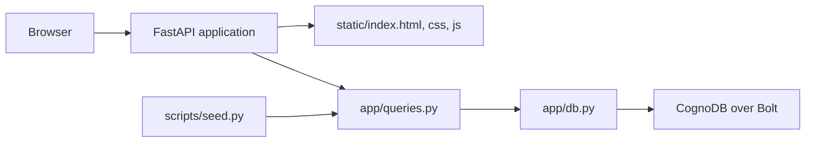
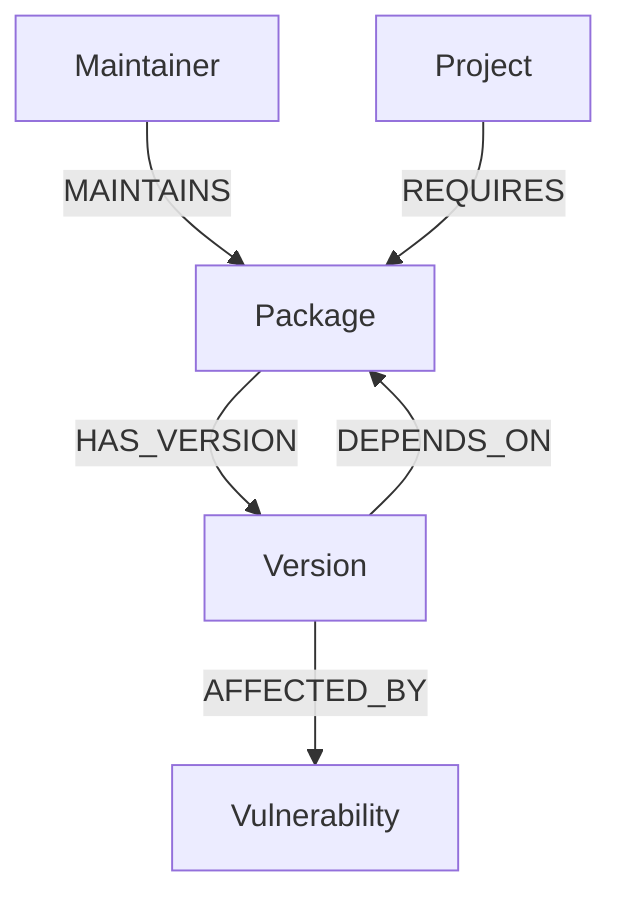

# DepGraph architecture

## Request flow

`app/main.py` is the application entry point. It serves the single-page
frontend and exposes JSON endpoints. `app/queries.py` owns the Cypher
statements. `app/db.py` owns the Neo4j driver lifecycle, parameter binding, and
clean database-unavailable errors.

## Graph model

- `Project`: an internal service or application.
- `Package`: an open-source dependency and ecosystem metadata.
- `Version`: a package release and its dependency edges.
- `Vulnerability`: a disclosed issue connected to an affected version.
- `Maintainer`: a publisher connected to packages they maintain.

The `Version -> Package -> Version` traversal preserves transitive dependency
paths. Cypher values are always passed as parameters; only fixed labels and
relationship types used by the seed script are included in query structure.

## Deployment boundary

Render runs the FastAPI process defined in `render.yaml`. CognoDB credentials
are supplied through Render environment secrets. Data seeding is a separate,
explicit operation so a deploy cannot accidentally wipe a shared graph.
